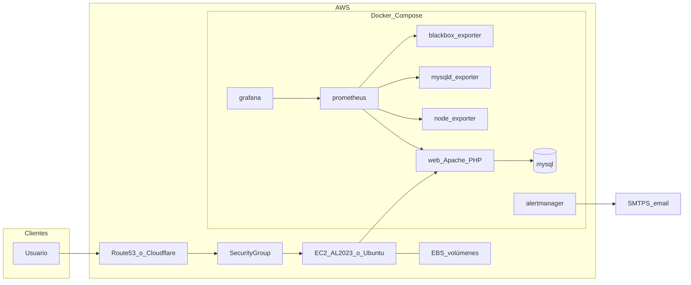

# Despliegue en AWS con Docker

Esta guía describe cómo ejecutar **Taller Mecánico** en **Amazon Web Services** usando **Docker Compose** sobre **EC2**, con opciones de **automatización** mediante **Packer** (AMI base con Docker) y el script [`scripts/deploy_aws_docker.sh`](../scripts/deploy_aws_docker.sh).

> **Importante:** El archivo [`docker-compose.yml`](../docker-compose.yml) del repo está pensado para desarrollo local (monta todo el código en el contenedor y publica muchos puertos). En AWS conviene usar **[`docker-compose.aws.yml`](../docker-compose.aws.yml)**.

## Arquitectura recomendada

Patrón habitual para un proyecto de este tamaño: **una instancia EC2** con **EBS cifrado**, **Docker Compose** levantando aplicación PHP/Apache, MySQL y stack de monitorización. TLS con **Application Load Balancer + ACM**, **Nginx/Caddy/Traefik** en la propia instancia, o **Cloudflare** / **Cloudflare Tunnel** delante.



### Archivos clave del repositorio

| Archivo | Uso |
|--------|-----|
| [`docker-compose.aws.yml`](../docker-compose.aws.yml) | Stack producción en EC2: **full** por defecto (`COMPOSE_PROFILES=monitoring,traffic`): app, MySQL, monitorización (Prometheus, Grafana, Alertmanager, exporters, cAdvisor, Telegraf) y simulador de tráfico + UI. Grafana/Prometheus/Alertmanager/UI simulador escuchan en `MONITORING_UI_HOST_BIND=0.0.0.0`; cAdvisor/Telegraf quedan privados en `EXPORTER_HOST_BIND=127.0.0.1`. |
| [`monitoring/prometheus/prometheus.aws.yml`](../monitoring/prometheus/prometheus.aws.yml) | Config Prometheus alineada con el compose AWS (incluye jobs `telegraf` y `cadvisor`). |
| [`.env.aws.example`](../.env.aws.example) | Plantilla full stack; copiar a `.env` y **rotar secretos** (o `SKIP_SECRET_STRICT_CHECK=1` solo en laboratorio). |
| [`packer/aws-docker-ami.pkr.hcl`](../packer/aws-docker-ami.pkr.hcl) | Plantilla Packer para AMI Ubuntu + Docker + Compose plugin. |
| [`scripts/deploy_aws_docker.sh`](../scripts/deploy_aws_docker.sh) | Preflight (paths, disco, RAM+swap vs perfiles), backup opcional, `compose build/up`, comprobación de **todos** los servicios del compose, smoke HTTP y healthchecks en loopback. |
| [`scripts/verify_aws_stack.sh`](../scripts/verify_aws_stack.sh) | Validación estática: `docker compose … config` sin arrancar contenedores. |
| [`scripts/taller-docker-safe-mode.sh`](../scripts/taller-docker-safe-mode.sh) | Usado por `taller-docker-safe-mode.service`: solo actúa si `ALLOW_DEGRADED_STACK=1` en `.env` y la memoria RAM+swap es baja (para contenedores opcionales). |
| [`scripts/ec2-user-data-bootstrap.sh`](../scripts/ec2-user-data-bootstrap.sh) | *User data* EC2 (**Amazon Linux 2023**): instala Docker/Compose/Buildx, clona en `/opt/taller_mecanico_asir`, instala *safe-mode* desde el repo y ejecuta `deploy_aws_docker.sh`. |

## Costes orientativos

Los precios cambian por región y uso; orden de magnitud **solo orientativo**:

| Concepto | Orden de magnitud (USD/mes) |
|----------|------------------------------|
| EC2 `t3.small` / `t3.medium` 24/7 | ~15–35 |
| EBS (gp3, según tamaño) | ~5–20 |
| Elastic IP (si está asociada y la instancia está parada, puede costar) | Revisar política actual de AWS |
| ALB + tráfico (si usas balanceador) | ~20–25 + datos |
| CloudWatch (logs/métricas detalladas) | Variable |
| **Total típico “una EC2 + disco”** | **~20–40** sin ALB; con ALB y logs puede acercarse a **45–70** |

**MySQL en contenedor** es económico y simple; para producción exigente valorar **Amazon RDS** (MySQL) en una iteración posterior (más coste, menos operación de disco/backups a mano).

## Requisitos previos

- Cuenta AWS y permisos para EC2, VPC, IAM (clave SSH o SSM).
- **Par de claves SSH** o acceso **Session Manager** sin SSH clásico.
- En tu máquina: **AWS CLI**, opcionalmente **Packer** si construyes la AMI.
- Dominio (opcional) para HTTPS y correo de alertas.

## Security Group recomendado

Reglas **mínimas** (ajusta IPs):

| Puerto | Origen | Destino |
|--------|--------|---------|
| 22 | Tu IP / bastión | SSH (o cierra SSH y usa SSM) |
| 80 | ALB, Cloudflare o `0.0.0.0/0` si sirves HTTP directo | `web` |
| 443 | Igual | Si terminas TLS en la instancia o proxy |
| 3000 | Tu IP/CIDR (`MONITORING_SG_CIDR`) | Grafana |
| 9090 | Tu IP/CIDR (`MONITORING_SG_CIDR`) | Prometheus |
| 9093 | Tu IP/CIDR (`MONITORING_SG_CIDR`) | Alertmanager |
| 8890 | Tu IP/CIDR (`MONITORING_SG_CIDR`) | UI simulador de tráfico |

**No** abras MySQL ni exporters: **3306**, **8080 (cAdvisor)**, **9273 (Telegraf)**, **9100/9104/9115**. Prometheus y Alertmanager no tienen login fuerte por defecto; el script abre puertos UI de forma automática si tiene IAM/`awscli`, pero debes restringir `MONITORING_SG_CIDR` a tu IP/CIDR cuando sea posible.

### Acceso navegador directo

Con el `.env.aws.example`, el despliegue deja las UIs accesibles por IP/DNS público:

- Grafana: `http://IP_PUBLICA:3000`
- Prometheus: `http://IP_PUBLICA:9090`
- Alertmanager: `http://IP_PUBLICA:9093`
- UI simulador de tráfico: `http://IP_PUBLICA:8890`

`scripts/deploy_aws_docker.sh` imprime estas URLs al final. Si hay permisos IAM, también autoriza reglas del Security Group para `3000`, `9090`, `9093`, `8890` usando `MONITORING_SG_CIDR` (por defecto `0.0.0.0/0` en laboratorio).

## Despliegue manual en EC2

### Opción A — Amazon Linux 2023 (recomendada para [`ec2-user-data-bootstrap.sh`](../scripts/ec2-user-data-bootstrap.sh))

1. **AMI:** última **Amazon Linux 2023** (p. ej. kernel 6.1 en la familia `al2023-ami-*`).
2. **Tipo / disco / SG / IAM:** igual que en la opción Ubuntu más abajo.
3. **User data:** pega el contenido de [`scripts/ec2-user-data-bootstrap.sh`](../scripts/ec2-user-data-bootstrap.sh) en *Advanced details* → *User data* ([documentación EC2](https://docs.aws.amazon.com/AWSEC2/latest/UserGuide/user-data.html)). Debe empezar por `#!/bin/bash`; usa texto plano salvo que codifiques tú en Base64 el script completo.

El script replica los pasos oficiales de AWS para instalar Docker en AL2023 ([*Installing Docker on AL2023*](https://docs.aws.amazon.com/AmazonECS/latest/developerguide/docker-basics.html#create-container-image-install-docker)): `dnf update -y`, `dnf install docker`, arranque del servicio y `ec2-user` en el grupo `docker`. Además instala `httpd` como fallback operativo, pero lo deja **parado y deshabilitado** para que no ocupe el puerto `80` que publica Docker (`web`). Los paquetes `docker`/`containerd` están en los repositorios principales de AL2023 ([notas AL2023 / ECS](https://docs.aws.amazon.com/linux/al2023/ug/ecs.html)). **Docker Compose V2** no forma parte de ese snippet de ECS; el bootstrap intenta `docker-compose-plugin` por `dnf` y, si no basta, instala el plugin según [Compose — instalación manual del plugin](https://docs.docker.com/compose/install/linux/#install-the-plugin-manually).

Log del arranque: `/var/log/taller-ec2-bootstrap.log`. Si el bootstrap crea `.env` desde `.env.aws.example` o detecta secretos placeholder, reemplaza automáticamente `MYSQL_PASSWORD`, `MYSQL_ROOT_PASSWORD`, `GRAFANA_ADMIN_PASSWORD` y `SIMULATOR_CONTROL_TOKEN` con valores aleatorios antes del despliegue. **Tras el primer arranque**, revisa/rota secretos en `.env` según tu política. El despliegue manual **falla** si quedan placeholders `CAMBIAR_*` o token `changeme` con perfil `traffic`, salvo `SKIP_SECRET_STRICT_CHECK=1` en laboratorio.

El bootstrap usa **reintentos** en `dnf`/`curl`, crea o agranda **swap persistente** (`SWAP_SIZE_GB=4` por defecto), comprueba `docker` / `docker compose` / `docker buildx` tras instalar plugins y, si el despliegue falla, deja en el log un volcado de `docker compose ps -a` y logs de **todos** los servicios del compose. Instala `taller-docker-safe-mode.service` desde [`scripts/taller-docker-safe-mode.sh`](../scripts/taller-docker-safe-mode.sh): **no para contenedores** salvo que en `.env` tengas `ALLOW_DEGRADED_STACK=1` y la instancia tenga poca memoria RAM+swap (modo degradado explícito). Puedes fijar versiones de fallback (si no basta el paquete `docker-compose-plugin` de AL2023) exportando antes del user data: `DOCKER_COMPOSE_VERSION` (por defecto `latest`, descarga el último release de Compose) y `DOCKER_BUILDX_VERSION` (por defecto `v0.19.3`).

**Si instalas a mano** (sin user data), equivalente al documento AWS:

```bash
sudo dnf update -y
sudo dnf install -y docker httpd
sudo systemctl disable --now httpd # instalado por si acaso; Docker web usa el puerto 80
sudo systemctl enable --now docker
sudo usermod -a -G docker ec2-user
# nueva sesión SSH para aplicar el grupo salvo que uses root para compose
```

### Opción B — Ubuntu 22.04 LTS

#### 1) Lanzar la instancia

- AMI: **Ubuntu Server 22.04 LTS** (o la AMI generada con Packer para Ubuntu).
- Tipo: al menos **t3.small** si incluyes monitorización completa (Prometheus/Grafana); **t3.medium** con más holgura.
- Disco raíz: **gp3**, tamaño acorde (p. ej. 30–50 GiB iniciales).
- **EBS cifrado** activado.
- Asociar **rol IAM** si usarás SSM, backups S3, etc.

En Ubuntu puedes automatizar con tu propio user data o seguir los pasos manuales siguientes (no uses el bootstrap de AL2023 tal cual: está pensado para `dnf`/Amazon Linux).

#### 2) Instalar Docker (si la AMI no lo trae)

```bash
# Documentación Docker para Ubuntu, o AMI construida con Packer
sudo apt-get update
sudo apt-get install -y ca-certificates curl gnupg
sudo install -m 0755 -d /etc/apt/keyrings
curl -fsSL https://download.docker.com/linux/ubuntu/gpg | sudo gpg --dearmor -o /etc/apt/keyrings/docker.gpg
echo "deb [arch=$(dpkg --print-architecture) signed-by=/etc/apt/keyrings/docker.gpg] https://download.docker.com/linux/ubuntu $(. /etc/os-release && echo \"$VERSION_CODENAME\") stable" | sudo tee /etc/apt/sources.list.d/docker.list > /dev/null
sudo apt-get update
sudo apt-get install -y docker-ce docker-ce-cli containerd.io docker-buildx-plugin docker-compose-plugin
sudo usermod -aG docker "$USER"
# cerrar sesión y volver a entrar para grupo docker
```

#### 3) Clonar el repositorio

```bash
sudo mkdir -p /opt/taller_mecanico_asir
sudo chown "$USER:$USER" /opt/taller_mecanico_asir
cd /opt/taller_mecanico_asir
git clone <URL_DE_TU_REPO> .
```

#### 4) Variables de entorno

```bash
cp .env.aws.example .env
nano .env   # o vim; rotar TODAS las contraseñas y tokens
```

Comprueba al menos:

- `MYSQL_ROOT_PASSWORD`, `MYSQL_PASSWORD`, `MYSQL_USER`, `MYSQL_DATABASE`
- `GRAFANA_ADMIN_PASSWORD`
- `SIMULATOR_CONTROL_TOKEN` (obligatorio con perfil `traffic`; no uses valores por defecto en producción)
- `APP_ENV=production`, `APP_DEBUG=false`
- `DEPLOY_MONITORING=1` y `COMPOSE_PROFILES=monitoring,traffic` (**full stack** por defecto en `.env.aws.example`). Ajusta `MIN_MONITORING_MEM_MB` / `MIN_TRAFFIC_STACK_MEM_MB` o usa `FORCE_MONITORING_ON_LOW_MEM=1` / `ALLOW_DEGRADED_STACK=1` según memoria RAM+swap (recomendado **t3.medium+** o al menos ~4 GiB RAM+swap; el bootstrap crea 4 GiB de swap por defecto).
- Para **solo** `web` + `mysql`: deja `COMPOSE_PROFILES` vacío y `DEPLOY_MONITORING=0`.
- SMTP para Alertmanager si quieres correos (`SMTP_*`, `ALERT_EMAIL_TO`). Si **no** configuras correo todavía, deja `ALERT_EMAIL_TO` vacío: el entrypoint de Alertmanager usa una config **noop** válida hasta que completes SMTP.

#### 4b) Validación estática (opcional)

```bash
chmod +x scripts/verify_aws_stack.sh
./scripts/verify_aws_stack.sh
# o con un .env concreto:
ENV_FILE=.env ./scripts/verify_aws_stack.sh
```

#### 5) Levantar el stack

```bash
./scripts/deploy_aws_docker.sh
docker compose -f docker-compose.aws.yml ps
```

La aplicación queda en el puerto configurado (`WEB_HOST_PORT`, por defecto **80**). Con el `.env.aws.example` actual, el stack **full** arranca monitorización y simulador de tráfico; Prometheus, Grafana, Alertmanager y la UI del simulador quedan accesibles en navegador por IP pública si el Security Group lo permite. cAdvisor y Telegraf siguen privados. Para un stack mínimo solo app + MySQL, vacía `COMPOSE_PROFILES` y pon `DEPLOY_MONITORING=0`.

### Verificación y Grafana (tras Opción A con user data o tras Opción B §5)

#### Comprobaciones HTTP en la instancia

```bash
curl -sf http://127.0.0.1/ | head
# Con perfiles monitoring:
curl -sf http://127.0.0.1:9090/-/healthy
curl -sf http://127.0.0.1:3000/api/health
# Con perfil traffic (UI, puerto TRAFFIC_SIMULATOR_UI_HOST_PORT):
curl -sf http://127.0.0.1:8890/health.php
```

(Desde fuera: `http://IP_PUBLICA/`, `http://IP_PUBLICA:3000`, `http://IP_PUBLICA:9090`, `http://IP_PUBLICA:9093`, `http://IP_PUBLICA:8890` si el SG lo permite.)

## HTTPS y dominio

El repo no fija un único método; opciones habituales:

1. **ALB + ACM**: certificado en el balanceador, objetivo instancia en 80 o 443.
2. **Nginx/Caddy** en EC2 con Let’s Encrypt (puertos 80/443 en SG).
3. **Cloudflare** delante (proxy naranja) + origen HTTP interno.
4. **Cloudflare Tunnel** (`cloudflared`) si no quieres abrir 80/443 (similar a comentarios en `docker-compose.dokploy.yml`).

Ajusta [`monitoring/prometheus/blackbox.yml`](../monitoring/prometheus/blackbox.yml) y URLs externas si pasas de HTTP interno a **HTTPS público** en probes sintéticos.

## Automatización con Packer (AMI con Docker)

Plantilla: [`packer/aws-docker-ami.pkr.hcl`](../packer/aws-docker-ami.pkr.hcl).

```bash
cd packer
packer init aws-docker-ami.pkr.hcl
packer validate aws-docker-ami.pkr.hcl
packer build aws-docker-ami.pkr.hcl
```

Requiere credenciales AWS (`AWS_ACCESS_KEY_ID` / `AWS_SECRET_ACCESS_KEY` o perfil) y región (variable `region`, por defecto `eu-west-1`). La AMI **no** incluye el proyecto ni secretos: solo Docker para arrancar más rápido.

Tras el build, crea una instancia desde esa AMI y continúa en “Clonar el repositorio” arriba.

## Automatización de despliegue / actualización

Script: [`scripts/deploy_aws_docker.sh`](../scripts/deploy_aws_docker.sh).

```bash
chmod +x scripts/deploy_aws_docker.sh
./scripts/deploy_aws_docker.sh
```

Comportamiento:

- **Preflight**: existencia de ficheros montados (`database/`, `monitoring/`), espacio libre (`MIN_FREE_DISK_MB`, por defecto 2 GiB), memoria RAM+swap vs perfiles (`MIN_MONITORING_MEM_MB`, `MIN_TRAFFIC_STACK_MEM_MB`) — **falla** si no hay recursos salvo `FORCE_MONITORING_ON_LOW_MEM=1` o `ALLOW_DEGRADED_STACK=1` (este último reduce el stack a solo `web`+`mysql`).
- **Secretos**: rechaza placeholders `CAMBIAR_*`, defaults débiles (`rootpassword`, `app_password`, `admin123`) y tokens `changeme` con perfil `traffic`, salvo `SKIP_SECRET_STRICT_CHECK=1`.
- Si ya existe el servicio `mysql`, intenta **backup** (`mysqldump` comprimido en `backups/`).
- `docker compose config` (validación), `build`, `pull`, `up -d` (con `--wait` si el cliente lo soporta).
- Tras el `up`, comprueba que **todos** los servicios del compose están en ejecución (y `healthy` si tienen healthcheck); smoke `GET /`, Prometheus, Grafana, Alertmanager y `/health.php` de la UI de tráfico en loopback cuando los perfiles lo exigen.

Variables útiles:

- `SKIP_BACKUP=1` — omitir backup (primer despliegue o mantenimiento).
- `COMPOSE_FILE=docker-compose.aws.yml` — por defecto ya es este archivo.
- `PROJECT_DIR` — raíz del repo si ejecutas desde otro directorio.
- `DEPLOY_MONITORING=1` — añade el perfil `monitoring` si faltaba en `COMPOSE_PROFILES`.
- `COMPOSE_PROFILES=monitoring,traffic` — stack completo (por defecto en `.env.aws.example`).
- `MIN_MONITORING_MEM_MB`, `MIN_TRAFFIC_STACK_MEM_MB`, `MIN_FREE_DISK_MB` — umbrales de preflight (`3200`, `3600` y `2048` MB por defecto).
- `FORCE_MONITORING_ON_LOW_MEM=1` — omite el fallo por memoria RAM+swap baja (riesgo de OOM).
- `ALLOW_DEGRADED_STACK=1` — si la memoria RAM+swap es baja, despliega solo `web`+`mysql` en lugar de fallar.
- `STACK_VERIFY_TIMEOUT_SEC` — tiempo máximo esperando servicios sanos (por defecto 420).
- `COMPOSE_BUILD_PARALLEL=1` — build paralelo (no recomendado en instancias pequeñas).

El script **no** hace `source .env` (evita romper contraseñas con `$`, `#`, espacios, etc.): pasa variables a Compose con `--env-file .env` cuando existe. Puertos para las comprobaciones (`WEB_HOST_PORT`, `PROMETHEUS_HOST_PORT`, etc.) se leen del mismo fichero sin evaluarlo como shell.

### Modo anti-colapso / recovery

Si la instancia se queda inaccesible tras levantar el stack completo, usa SSM/SSH cuando vuelva a responder. Opciones:

```bash
# Opcion A: poner ALLOW_DEGRADED_STACK=1 en .env y reiniciar el servicio safe-mode (o ejecutarlo a mano):
sudo sed -i 's/^ALLOW_DEGRADED_STACK=.*/ALLOW_DEGRADED_STACK=1/' /opt/taller_mecanico_asir/.env
sudo /usr/local/sbin/taller-docker-safe-mode
cd /opt/taller_mecanico_asir
# Opcion B: editar .env (COMPOSE_PROFILES vacio, DEPLOY_MONITORING=0) y reaplicar:
sudo docker compose --env-file .env -f docker-compose.aws.yml up -d --remove-orphans
```

En nuevos despliegues, el bootstrap deja **swap** persistente y habilita `taller-docker-safe-mode.service`, que ejecuta [`scripts/taller-docker-safe-mode.sh`](../scripts/taller-docker-safe-mode.sh) al arrancar: **no altera contenedores** salvo que `ALLOW_DEGRADED_STACK=1` en `.env` y la memoria RAM+swap sea inferior a `MIN_MONITORING_MEM_MB`.

## Persistencia y copias de seguridad

Volúmenes Docker nombrados en el compose: datos de MySQL, Prometheus, Grafana, Alertmanager, imágenes subidas, logs y caché de la app.

Recomendado además:

- **Snapshots EBS** programados (Lifecycle Manager).
- Copiar `backups/*.sql.gz` a **S3** con cifrado y política de retención.
- Restauración: detener tráfico, restaurar volúmen o importar SQL en `mysql`.

Puedes usar también [`docker/backup.sh`](../docker/backup.sh) montando credenciales si ejecutas un contenedor one-off; el script de despliegue ya cubre el caso más común en EC2.

## Seguridad operativa

- Rotar credenciales por defecto de [`.env.example`](../.env.example); nunca subir `.env` real al Git (está en `.gitignore`).
- Endpoint [`/metrics.php`](../monitoring/php-exporter/metrics.php): tratar como **interno**; en este compose Prometheus scrapea por red Docker; no hace falta publicar métricas al Internet.
- **Simulador de tráfico** (perfil `traffic` en [`docker-compose.aws.yml`](../docker-compose.aws.yml)): la UI queda en **loopback** por defecto; no recomendado exponer sin firewall. Rota `SIMULATOR_CONTROL_TOKEN`.
- El exporter MySQL en [`docker-compose.aws.yml`](../docker-compose.aws.yml) usa **`MYSQL_USER` / `MYSQL_PASSWORD`** alineados con el usuario de aplicación (evita el fallo típico `root` + contraseña de `app_user`).

## Incidencias frecuentes

| Síntoma | Comprobación |
|---------|----------------|
| 502 / sin respuesta | `docker compose -f docker-compose.aws.yml logs web`; SG permite puerto 80/443. |
| Prometheus “down” para algún target | `docker compose logs prometheus`; revisar que los nombres de servicio coinciden con `prometheus.aws.yml`. |
| Grafana inaccesible desde fuera | Es **normal**: solo `127.0.0.1` en el host; usar túnel SSH o reverso seguro. |
| `compose build requires buildx 0.17.0 or later` (AL2023) | El RPM `docker` puede traer Buildx antiguo. Instala plugin ≥ 0.17, p. ej. `curl` del release [buildx](https://github.com/docker/buildx/releases) a `/usr/libexec/docker/cli-plugins/docker-buildx` + `chmod +x`; el bootstrap ya fuerza Buildx reciente. Luego `SKIP_BACKUP=1 ./scripts/deploy_aws_docker.sh`. |
| Alertmanager cae al arrancar / Prometheus no levanta | Comprueba montaje en [`docker-compose.aws.yml`](../docker-compose.aws.yml) (`alertmanager.yml` → `/etc/alertmanager/config/alertmanager.yml`) y logs: `docker compose logs alertmanager`. Sin correo configurado debe usarse config noop (entrypoint). |
| `missing to address in email config` (Alertmanager) | Rellena `ALERT_EMAIL_TO` **y** como mínimo `SMTP_SMARTHOST` y `SMTP_FROM`, o deja correo vacío para modo noop hasta configurar SMTP. |
| Fallos raros al cargar `.env` en el despliegue | No edites `.env` con sintaxis rara en una sola línea; el deploy ya no hace `source .env`. Usa `docker compose ... --env-file .env` explícitamente si llamas a Compose a mano. |
| `permission denied` al conectar a `/var/run/docker.sock` como `ec2-user` | Tras `usermod -a -G docker`, la sesión SSH **abierta** no recibe el grupo hasta **nueva conexión SSH** o `newgrp docker`. Comprueba `groups`. Temporalmente: `sudo docker ps`. ([Guía AWS — mismo aviso tras añadir el usuario al grupo `docker`](https://docs.aws.amazon.com/AmazonECS/latest/developerguide/docker-basics.html#create-container-image-install-docker).) |

## Evolución recomendada

- **RDS MySQL** (o Aurora compatible MySQL) + cambiar `DB_HOST` / variables según endpoint gestionado (véase alias en [`config/database.php`](../config/database.php)).
- **Separar monitorización** en otra instancia o servicio gestionado para reducir carga en la app.
- **CI/CD**: GitHub Actions que SSH/rsync o CodeDeploy al servidor, ejecutando `deploy_aws_docker.sh` con secretos en el runner o en AWS.

## Referencias cruzadas

- Despliegue Docker genérico: [DOCKER_DEPLOYMENT.md](DOCKER_DEPLOYMENT.md)
- Monitorización: [MONITORING_SETUP_GUIDE.md](MONITORING_SETUP_GUIDE.md)
