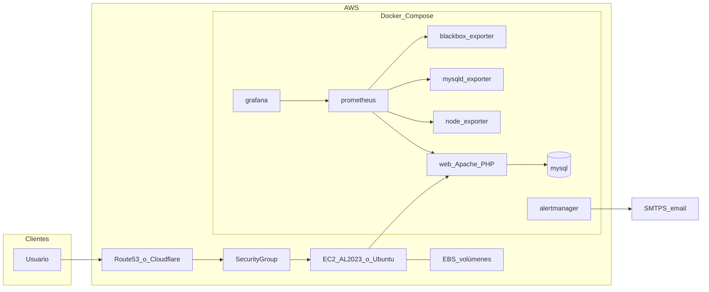

# Despliegue en AWS con Docker

Esta guía describe cómo ejecutar **Taller Mecánico** en **Amazon Web Services** usando **Docker Compose** sobre **EC2**, con opciones de **automatización** mediante **Packer** (AMI base con Docker) y el script [`scripts/deploy_aws_docker.sh`](../scripts/deploy_aws_docker.sh).

> **Importante:** El archivo [`docker-compose.yml`](../docker-compose.yml) del repo está pensado para desarrollo local (monta todo el código en el contenedor y publica muchos puertos). En AWS conviene usar **[`docker-compose.aws.yml`](../docker-compose.aws.yml)**.

## Arquitectura recomendada

Patrón habitual para un proyecto de este tamaño: **una instancia EC2** con **EBS cifrado**, **Docker Compose** levantando aplicación PHP/Apache, MySQL y stack de monitorización. TLS con **Application Load Balancer + ACM**, **Nginx/Caddy/Traefik** en la propia instancia, o **Cloudflare** / **Cloudflare Tunnel** delante.



### Archivos clave del repositorio

| Archivo | Uso |
|--------|-----|
| [`docker-compose.aws.yml`](../docker-compose.aws.yml) | Stack producción en EC2: sin bind-mount del código, MySQL sin puerto público, Prometheus/Grafana/Alertmanager solo en `127.0.0.1`. |
| [`monitoring/prometheus/prometheus.aws.yml`](../monitoring/prometheus/prometheus.aws.yml) | Config Prometheus sin jobs `telegraf`/`cadvisor` (no están en este compose). |
| [`.env.aws.example`](../.env.aws.example) | Plantilla de variables para el servidor; copiar a `.env` y rotar secretos. |
| [`packer/aws-docker-ami.pkr.hcl`](../packer/aws-docker-ami.pkr.hcl) | Plantilla Packer para AMI Ubuntu + Docker + Compose plugin. |
| [`scripts/deploy_aws_docker.sh`](../scripts/deploy_aws_docker.sh) | Backup opcional, `compose build/up`, comprobaciones HTTP. |
| [`scripts/ec2-user-data-bootstrap.sh`](../scripts/ec2-user-data-bootstrap.sh) | *User data* EC2 (**Amazon Linux 2023**): sigue la instalación de Docker de la [guía de Amazon ECS](https://docs.aws.amazon.com/AmazonECS/latest/developerguide/docker-basics.html#create-container-image-install-docker), añade Compose si hace falta, clona en `/opt/taller_mecanico_asir` y ejecuta `deploy_aws_docker.sh`. |

## Costes orientativos

Los precios cambian por región y uso; orden de magnitud **solo orientativo**:

| Concepto | Orden de magnitud (USD/mes) |
|----------|------------------------------|
| EC2 `t3.small` / `t3.medium` 24/7 | ~15–35 |
| EBS (gp3, según tamaño) | ~5–20 |
| Elastic IP (si está asociada y la instancia está parada, puede costar) | Revisar política actual de AWS |
| ALB + tráfico (si usas balanceador) | ~20–25 + datos |
| CloudWatch (logs/métricas detalladas) | Variable |
| **Total típico “una EC2 + disco”** | **~20–40** sin ALB; con ALB y logs puede acercarse a **45–70** |

**MySQL en contenedor** es económico y simple; para producción exigente valorar **Amazon RDS** (MySQL) en una iteración posterior (más coste, menos operación de disco/backups a mano).

## Requisitos previos

- Cuenta AWS y permisos para EC2, VPC, IAM (clave SSH o SSM).
- **Par de claves SSH** o acceso **Session Manager** sin SSH clásico.
- En tu máquina: **AWS CLI**, opcionalmente **Packer** si construyes la AMI.
- Dominio (opcional) para HTTPS y correo de alertas.

## Security Group recomendado

Reglas **mínimas** (ajusta IPs):

| Puerto | Origen | Destino |
|--------|--------|---------|
| 22 | Tu IP / bastión | SSH (o cierra SSH y usa SSM) |
| 80 | ALB, Cloudflare o `0.0.0.0/0` si sirves HTTP directo | `web` |
| 443 | Igual | Si terminas TLS en la instancia o proxy |

**No** abras al mundo: **3306 (MySQL)**, **9090 (Prometheus)**, **3000 (Grafana)**, **9093 (Alertmanager)**, exporters. En [`docker-compose.aws.yml`](../docker-compose.aws.yml) la monitorización queda en **loopback** (`127.0.0.1`); acceso vía **túnel SSH** o proxy interno.

## Despliegue manual en EC2

### Opción A — Amazon Linux 2023 (recomendada para [`ec2-user-data-bootstrap.sh`](../scripts/ec2-user-data-bootstrap.sh))

1. **AMI:** última **Amazon Linux 2023** (p. ej. kernel 6.1 en la familia `al2023-ami-*`).
2. **Tipo / disco / SG / IAM:** igual que en la opción Ubuntu más abajo.
3. **User data:** pega el contenido de [`scripts/ec2-user-data-bootstrap.sh`](../scripts/ec2-user-data-bootstrap.sh) en *Advanced details* → *User data* ([documentación EC2](https://docs.aws.amazon.com/AWSEC2/latest/UserGuide/user-data.html)). Debe empezar por `#!/bin/bash`; usa texto plano salvo que codifiques tú en Base64 el script completo.

El script replica los pasos oficiales de AWS para instalar Docker en AL2023 ([*Installing Docker on AL2023*](https://docs.aws.amazon.com/AmazonECS/latest/developerguide/docker-basics.html#create-container-image-install-docker)): `dnf update -y`, `dnf install docker`, arranque del servicio y `ec2-user` en el grupo `docker`. Los paquetes `docker`/`containerd` están en los repositorios principales de AL2023 ([notas AL2023 / ECS](https://docs.aws.amazon.com/linux/al2023/ug/ecs.html)). **Docker Compose V2** no forma parte de ese snippet de ECS; el bootstrap intenta `docker-compose-plugin` por `dnf` y, si no basta, instala el plugin según [Compose — instalación manual del plugin](https://docs.docker.com/compose/install/linux/#install-the-plugin-manually).

Log del arranque: `/var/log/taller-ec2-bootstrap.log`. **Tras el primer arranque**, rota secretos en `.env`.

**Si instalas a mano** (sin user data), equivalente al documento AWS:

```bash
sudo dnf update -y
sudo dnf install -y docker
sudo systemctl enable --now docker
sudo usermod -a -G docker ec2-user
# nueva sesión SSH para aplicar el grupo salvo que uses root para compose
```

### Opción B — Ubuntu 22.04 LTS

#### 1) Lanzar la instancia

- AMI: **Ubuntu Server 22.04 LTS** (o la AMI generada con Packer para Ubuntu).
- Tipo: al menos **t3.small** si incluyes monitorización completa (Prometheus/Grafana); **t3.medium** con más holgura.
- Disco raíz: **gp3**, tamaño acorde (p. ej. 30–50 GiB iniciales).
- **EBS cifrado** activado.
- Asociar **rol IAM** si usarás SSM, backups S3, etc.

En Ubuntu puedes automatizar con tu propio user data o seguir los pasos manuales siguientes (no uses el bootstrap de AL2023 tal cual: está pensado para `dnf`/Amazon Linux).

#### 2) Instalar Docker (si la AMI no lo trae)

```bash
# Documentación Docker para Ubuntu, o AMI construida con Packer
sudo apt-get update
sudo apt-get install -y ca-certificates curl gnupg
sudo install -m 0755 -d /etc/apt/keyrings
curl -fsSL https://download.docker.com/linux/ubuntu/gpg | sudo gpg --dearmor -o /etc/apt/keyrings/docker.gpg
echo "deb [arch=$(dpkg --print-architecture) signed-by=/etc/apt/keyrings/docker.gpg] https://download.docker.com/linux/ubuntu $(. /etc/os-release && echo \"$VERSION_CODENAME\") stable" | sudo tee /etc/apt/sources.list.d/docker.list > /dev/null
sudo apt-get update
sudo apt-get install -y docker-ce docker-ce-cli containerd.io docker-buildx-plugin docker-compose-plugin
sudo usermod -aG docker "$USER"
# cerrar sesión y volver a entrar para grupo docker
```

#### 3) Clonar el repositorio

```bash
sudo mkdir -p /opt/taller_mecanico_asir
sudo chown "$USER:$USER" /opt/taller_mecanico_asir
cd /opt/taller_mecanico_asir
git clone <URL_DE_TU_REPO> .
```

#### 4) Variables de entorno

```bash
cp .env.aws.example .env
nano .env   # o vim; rotar TODAS las contraseñas y tokens
```

Comprueba al menos:

- `MYSQL_ROOT_PASSWORD`, `MYSQL_PASSWORD`, `MYSQL_USER`, `MYSQL_DATABASE`
- `GRAFANA_ADMIN_PASSWORD`
- `APP_ENV=production`, `APP_DEBUG=false`
- SMTP para Alertmanager si quieres correos (`SMTP_*`, `ALERT_EMAIL_TO`)

#### 5) Levantar el stack

```bash
docker compose -f docker-compose.aws.yml --env-file .env up -d --build
docker compose -f docker-compose.aws.yml ps
```

La aplicación queda en el puerto configurado (`WEB_HOST_PORT`, por defecto **80**). Prometheus y Grafana escuchan solo en **localhost** del servidor.

### Verificación y Grafana (tras Opción A con user data o tras Opción B §5)

#### Comprobaciones HTTP en la instancia

```bash
curl -sf http://127.0.0.1/ | head
curl -sf http://127.0.0.1:9090/-/healthy
```

(Desde fuera: `http://IP_PUBLICA/` si el SG permite 80.)

#### Acceso a Grafana por túnel SSH

Usuario SSH según AMI: **`ec2-user`** (Amazon Linux) o **`ubuntu`** (Ubuntu).

```bash
ssh -L 3000:127.0.0.1:3000 ec2-user@IP_PUBLICA
# Navegador local: http://127.0.0.1:3000
```

## HTTPS y dominio

El repo no fija un único método; opciones habituales:

1. **ALB + ACM**: certificado en el balanceador, objetivo instancia en 80 o 443.
2. **Nginx/Caddy** en EC2 con Let’s Encrypt (puertos 80/443 en SG).
3. **Cloudflare** delante (proxy naranja) + origen HTTP interno.
4. **Cloudflare Tunnel** (`cloudflared`) si no quieres abrir 80/443 (similar a comentarios en `docker-compose.dokploy.yml`).

Ajusta [`monitoring/prometheus/blackbox.yml`](../monitoring/prometheus/blackbox.yml) y URLs externas si pasas de HTTP interno a **HTTPS público** en probes sintéticos.

## Automatización con Packer (AMI con Docker)

Plantilla: [`packer/aws-docker-ami.pkr.hcl`](../packer/aws-docker-ami.pkr.hcl).

```bash
cd packer
packer init aws-docker-ami.pkr.hcl
packer validate aws-docker-ami.pkr.hcl
packer build aws-docker-ami.pkr.hcl
```

Requiere credenciales AWS (`AWS_ACCESS_KEY_ID` / `AWS_SECRET_ACCESS_KEY` o perfil) y región (variable `region`, por defecto `eu-west-1`). La AMI **no** incluye el proyecto ni secretos: solo Docker para arrancar más rápido.

Tras el build, crea una instancia desde esa AMI y continúa en “Clonar el repositorio” arriba.

## Automatización de despliegue / actualización

Script: [`scripts/deploy_aws_docker.sh`](../scripts/deploy_aws_docker.sh).

```bash
chmod +x scripts/deploy_aws_docker.sh
./scripts/deploy_aws_docker.sh
```

Comportamiento:

- Si ya existe el servicio `mysql`, intenta **backup** (`mysqldump` comprimido en `backups/`).
- `docker compose build` + `pull` + `up -d`.
- Comprueba HTTP en `/` y salud de Prometheus en loopback.

Variables útiles:

- `SKIP_BACKUP=1` — omitir backup (primer despliegue o mantenimiento).
- `COMPOSE_FILE=docker-compose.aws.yml` — por defecto ya es este archivo.
- `PROJECT_DIR` — raíz del repo si ejecutas desde otro directorio.

## Persistencia y copias de seguridad

Volúmenes Docker nombrados en el compose: datos de MySQL, Prometheus, Grafana, Alertmanager, imágenes subidas, logs y caché de la app.

Recomendado además:

- **Snapshots EBS** programados (Lifecycle Manager).
- Copiar `backups/*.sql.gz` a **S3** con cifrado y política de retención.
- Restauración: detener tráfico, restaurar volúmen o importar SQL en `mysql`.

Puedes usar también [`docker/backup.sh`](../docker/backup.sh) montando credenciales si ejecutas un contenedor one-off; el script de despliegue ya cubre el caso más común en EC2.

## Seguridad operativa

- Rotar credenciales por defecto de [`.env.example`](../.env.example); nunca subir `.env` real al Git (está en `.gitignore`).
- Endpoint [`/metrics.php`](../monitoring/php-exporter/metrics.php): tratar como **interno**; en este compose Prometheus scrapea por red Docker; no hace falta publicar métricas al Internet.
- **Simulador de tráfico** (`docker-compose.yml` perfil `traffic`): no recomendado en producción pública sin controles; si se usa, rotar `SIMULATOR_CONTROL_TOKEN` y no exponer la UI.
- El exporter MySQL en [`docker-compose.aws.yml`](../docker-compose.aws.yml) usa **`MYSQL_USER` / `MYSQL_PASSWORD`** alineados con el usuario de aplicación (evita el fallo típico `root` + contraseña de `app_user`).

## Incidencias frecuentes

| Síntoma | Comprobación |
|---------|----------------|
| 502 / sin respuesta | `docker compose -f docker-compose.aws.yml logs web`; SG permite puerto 80/443. |
| Prometheus “down” para algún target | `docker compose logs prometheus`; revisar que los nombres de servicio coinciden con `prometheus.aws.yml`. |
| Grafana inaccesible desde fuera | Es **normal**: solo `127.0.0.1` en el host; usar túnel SSH o reverso seguro. |
| `compose build requires buildx 0.17.0 or later` (AL2023) | El RPM `docker` puede traer Buildx antiguo. Instala plugin ≥ 0.17, p. ej. `curl` del release [buildx](https://github.com/docker/buildx/releases) a `/usr/libexec/docker/cli-plugins/docker-buildx` + `chmod +x`; el bootstrap ya fuerza Buildx reciente. Luego `SKIP_BACKUP=1 ./scripts/deploy_aws_docker.sh`. |

- **RDS MySQL** (o Aurora compatible MySQL) + cambiar `DB_HOST` / variables según endpoint gestionado (véase alias en [`config/database.php`](../config/database.php)).
- **Separar monitorización** en otra instancia o servicio gestionado para reducir carga en la app.
- **CI/CD**: GitHub Actions que SSH/rsync o CodeDeploy al servidor, ejecutando `deploy_aws_docker.sh` con secretos en el runner o en AWS.

## Referencias cruzadas

- Despliegue Docker genérico: [DOCKER_DEPLOYMENT.md](DOCKER_DEPLOYMENT.md)
- Monitorización: [MONITORING_SETUP_GUIDE.md](MONITORING_SETUP_GUIDE.md)
